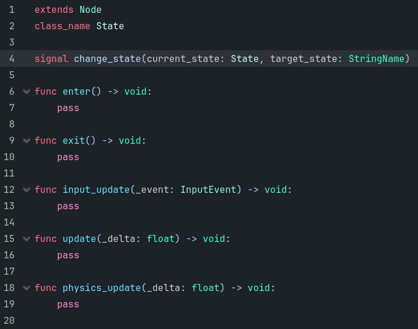
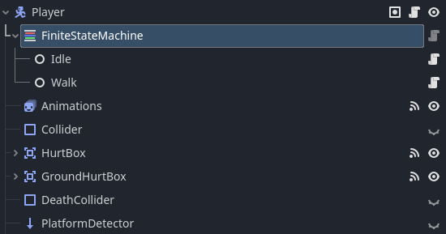
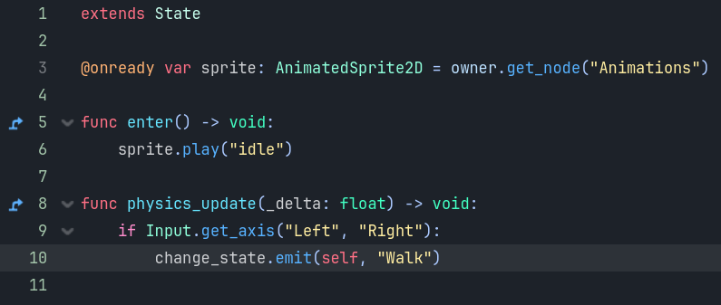

# Godot Finite State Machine

A simple and extensible Finite State Machine (FSM) implementation for the Godot Engine written in GDScript.

---

## 📦 Setup

### Step 1:
Download the tool from the repository:  
👉 [Download ZIP](https://codeload.github.com/Kayzori/Godot-Finite-State-Machine/zip/refs/heads/main)

### Step 2:
Extract the ZIP and move the folder:

```bash
# From this:
Godot-Finite-State-Machine-main/FiniteStateMachine

# To your project:
res://Addons/FiniteStateMachine
```

> 💡 If the `Addons/` folder doesn’t exist, just create it manually.

### Step 3:
In the Godot Editor:

1. Go to `Project -> Project Settings`
2. Open the **Plugins** tab
3. Enable the **FiniteStateMachine** plugin
4. Reload your project if needed

---

## 🧠 How It Works

The tool is built around two core classes:

---

## 🧩 `State.gd`

This is a base class for creating states. Each of your states (Idle, Walk, Jump, etc.) should inherit from this class.

### Key Methods:
- `enter()`: Called when the state becomes active
- `exit()`: Called when the state is exited
- `input_update(event: InputEvent)`: For handling input in the current state
- `update(delta: float)`: For frame updates
- `physics_update(delta: float)`: For physics-related updates

### Signal:
```gdscript
signal change_state(current_state: State, target_state: StringName)
```

Use this to request a state change from within a state:
```gdscript
change_state.emit(self, "Walk")
```

---

## 🧠 `FiniteStateMachine.gd`

The `FiniteStateMachine` node is responsible for managing your states.

### Variables:
- `initial_state`: The state to start with (set in the editor)
- `current_state`: The state that is currently active
- `states`: Dictionary holding all child states by name

### Main Functions:
- `_ready()`: Registers child state nodes
- `_input()`, `_process()`, `_physics_process()`: Delegates updates to the current state
- `on_child_change_state(...)`: Handles state transitions

---

## 🧰 How To Use

### 1. Add FSM Node

Create a `FiniteStateMachine` node inside your Player (or any parent) node.  
Add state nodes like `Idle`, `Walk`, etc. as children of this FSM node.

```
Player
├── FiniteStateMachine
│   ├── Idle
│   └── Walk
```

### 2. Attach Scripts

- Attach the `State.gd` base script to each child state node.
- Extend the base and override relevant methods (`enter`, `physics_update`, etc.).

```gdscript
extends State

@onready var sprite: AnimatedSprite2D = owner.get_node("Animations")

func enter() -> void:
    sprite.play("idle")

func physics_update(_delta: float) -> void:
    if Input.get_axis("Left", "Right"):
        change_state.emit(self, "Walk")
```

---

## 📝 Example: Switching from Idle to Walk

If input is detected:
```gdscript
if Input.get_axis("Left", "Right"):
    change_state.emit(self, "Walk")
```

This emits a signal to the FSM, which:
- Checks if the current state is different
- Calls `exit()` on the current state
- Finds and calls `enter()` on the new state
- Updates `current_state`

---

## 📸 Screenshots

### State Class Example


### FiniteStateMachine Structure


### State Switch Logic


---

## ✅ Pros

- Clean separation of logic
- Easy to add new states
- Reusable base class
- Native Godot plugin support

---

## 💬 License

MIT – use freely in personal or commercial projects.

---

## 🙏 Credits

Original implementation by [Kayzori](https://github.com/Kayzori)
